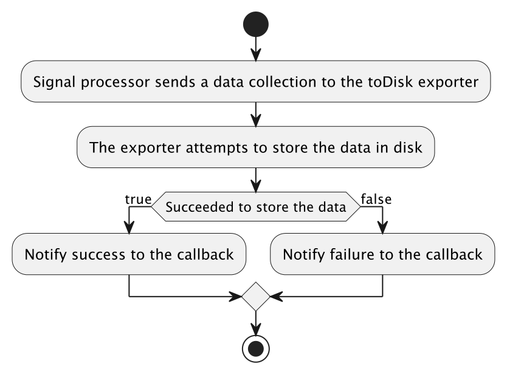
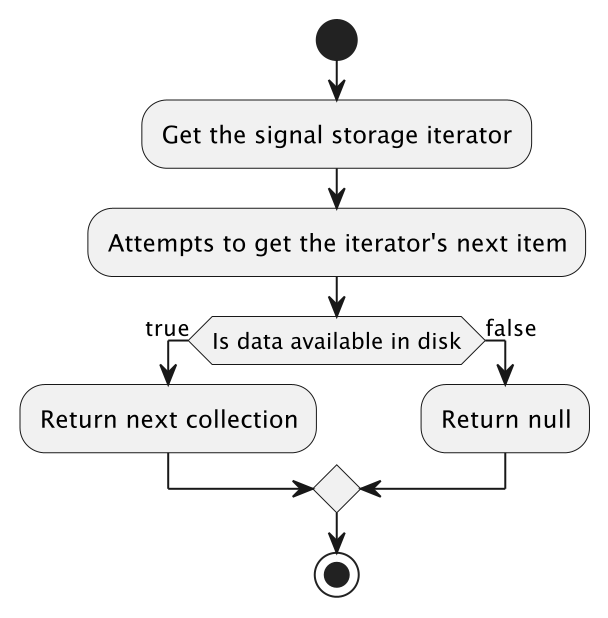

# Contributor Guide

Each one of the three exporters provided by this
tool ([LogRecordDiskExporter](src/main/java/io/opentelemetry/contrib/disk/buffering/LogRecordDiskExporter.java), [MetricDiskExporter](src/main/java/io/opentelemetry/contrib/disk/buffering/MetricDiskExporter.java)
and [SpanDiskExporter](src/main/java/io/opentelemetry/contrib/disk/buffering/SpanDiskExporter.java))
is responsible of performing 2 actions, `write` and `read/delegate`, the `write` one happens
automatically as a set of signals are provided from the processor, while the `read/delegate` one has
to be triggered manually by the consumer of this library as explained in the [README](README.md).

## Writing overview

* The writing process happens automatically within its `export(Collection<SignalData> signals)`
  method, which is called by the configured signal processor.
* When a set of signals is received, these are delegated over to
  the [DiskExporter](src/main/java/io/opentelemetry/contrib/disk/buffering/internal/exporters/DiskExporter.java)
  class which then serializes them using an implementation
  of [SignalSerializer](src/main/java/io/opentelemetry/contrib/disk/buffering/internal/serialization/serializers/SignalSerializer.java)
  and then the serialized data is appended into a File using an instance of
  the [Storage](src/main/java/io/opentelemetry/contrib/disk/buffering/internal/storage/Storage.java)
  class.
* The data is written into a file directly, without the use of a buffer, to make sure no data gets
  lost in case the application ends unexpectedly.
* Each disk exporter stores its signals in its own folder, which is expected to contain files
  that belong to that type of signal only.
* Each file may contain more than a batch of signals if the configuration parameters allow enough
  limit size for it.
* If the configured folder size for the signals has been reached and a new file is needed to be
  created to keep storing new data, the oldest available file will be removed to make space for the
  new one.
* The [Storage](src/main/java/io/opentelemetry/contrib/disk/buffering/internal/storage/Storage.java),
  [FolderManager](src/main/java/io/opentelemetry/contrib/disk/buffering/internal/storage/FolderManager.java)
  and [WritableFile](src/main/java/io/opentelemetry/contrib/disk/buffering/internal/storage/files/WritableFile.java)
  files contain more information on the details of the writing process into a file.

## Reading overview

* The reading process has to be triggered manually by the library consumer as explained in
  the [README](README.md).
* A single file is read at a time and updated to remove the data gathered from it after it is
  successfully exported, until it's emptied. Each file previously created during the
  writing process has a timestamp in milliseconds, which is used to determine what file to start
  reading from, which will be the oldest one available.
* If the oldest file available is stale, which is determined based on the configuration provided at
  the time of creating the disk exporter, then it will be ignored, and the next oldest (and
  unexpired) one will be used instead.
* All the stale and empty files will be removed as a new file is created.
* The [Storage](src/main/java/io/opentelemetry/contrib/disk/buffering/internal/storage/Storage.java),
  [FolderManager](src/main/java/io/opentelemetry/contrib/disk/buffering/internal/storage/FolderManager.java)
  and [ReadableFile](src/main/java/io/opentelemetry/contrib/disk/buffering/internal/storage/files/ReadableFile.java)
  files contain more information on the details of the file reading process.
* Note that the reader delegates the data to the exporter exactly in the way it has received the
  data - it does not try to batch data (but this could be an optimization in the future).
